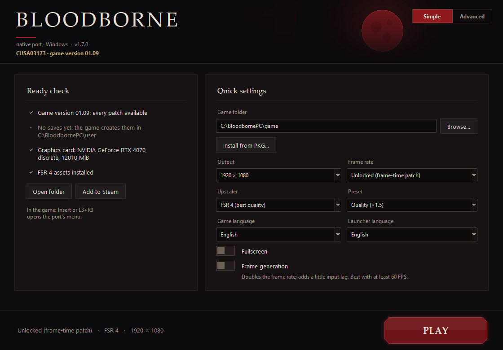
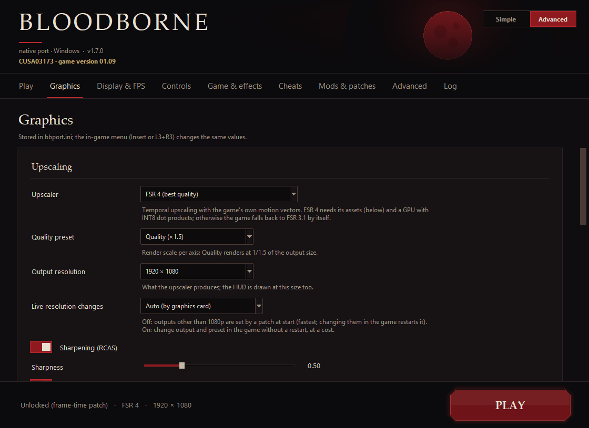

<div align="center">

# Bloodborne PC

**A native port of Bloodborne for Windows 10 and 11. No emulator.**

[English](README.md) · [Русский](docs/original-readme/README.ru.md)

<a href="https://github.com/AdrianCsT/bloodborne_pc/releases/latest"></a>
<a href="https://github.com/AdrianCsT/bloodborne_pc/releases"></a>
<a href="LICENSE"></a>

<a href="https://discord.gg/yTMG8c4Bqm"></a>



</div>

> [!NOTE]
> This project is not related to shadPS4. Please send questions about it to
> [our Discord server](https://discord.gg/KYZRKk9CB), not to the shadPS4 server.

## Table of contents

**1.** [**About**](#about)  
**2.** [**Features**](#features)  
**3.** [**Download and install**](#download-and-install)  
**4.** [**Requirements**](#requirements)  
**5.** [**Controls**](#controls)  
**6.** [**FAQ and troubleshooting**](#faq-and-troubleshooting)  
**7.** [**How it works**](#how-it-works)  
**8.** [**Building from source**](#building-from-source)  
**9.** [**Settings and environment variables**](#settings-and-environment-variables)  
**10.** [**Project layout and roadmap**](#project-layout-and-roadmap)  
**11.** [**Credits and licenses**](#credits-and-licenses)

## About

Bloodborne PC runs *Bloodborne* for PlayStation 4 (CUSA03173, game version 1.09) on a Windows 10 or 11 PC. The Linux version of the port is in the upstream project. There is no emulator in the middle. The game's own x86-64 code runs on your CPU, and its graphics are translated to Vulkan by a renderer derived from [shadPS4](https://github.com/shadps4-emu/shadPS4).

**Status: experimental, playable.** The game boots, loads saves and plays with sound, gamepad and saving. The Hunter's Dream and several areas of Yharnam were played with it. A full play-through has not been verified.

> [!IMPORTANT]
> **No game files are included.** You need your own dump of Bloodborne (CUSA03173, version 1.09), or the PS4 `.pkg` files for it. This project is not affiliated with Sony Interactive Entertainment, FromSoftware, AMD or NVIDIA.

### What this fork combines

This fork brings together the work of several people and adds a few things of its own.

| Source | What it brings |
|---|---|
| [deadinside28](https://github.com/deadinside28/bloodborne_pc), port release 0.4 | The original project: the native Linux port and the renderer work behind it |
| [Supermedo](https://github.com/Supermedo/bloodborne_pc), Windows port v1.5 | The Windows port, a launcher in 13 languages, NVIDIA DLSS (RTX 20 series and newer), AMD FSR 3.1 and FSR 4 |
| This fork | Support for *The Old Hunters* DLC license (experimental) |
| This fork | A redesigned launcher with Simple and Advanced modes and animations |
| This fork | Install from PKG: the launcher installs the game from your PS4 `.pkg` files (base game, update and DLC) |
| This fork | Frame generation: FSR 3.1 frame interpolation on top of FSR 4, FSR 3.1, DLSS or XeSS, about twice the frames on screen from a 60 FPS base, with the HUD kept sharp |
| This fork | Intel XeSS 3.0.2 as an upscaler for any GPU, and a launcher that greys out the upscalers a GPU cannot run, with the reason |
| This fork | ReShade 6.8 with two Bloodborne presets (Natural and Vivid), switched on from the launcher |
| This fork | Shaders compiled ahead of the frame on the draw-preparation threads, and the driver's pipeline cache saved between runs: fewer first-time stutters |
| This fork | Object motion vectors on AMD GPUs under Windows: their driver lost the device on the raw-pointer stores, so the motion buffers are now storage-buffer bindings (upstream [issue #39](https://github.com/deadinside28/bloodborne_pc/issues/39)) |
| This fork | A fix for the crash when you are attacked on Intel 12th gen and newer CPUs (red-zone protection, from Supermedo [PR #2](https://github.com/Supermedo/bloodborne_pc/pull/2)) |
| This fork | A live VRAM budget on Windows |

## Features

- **One launcher for every setting**, in 13 languages: English, Arabic, Russian, Spanish, Portuguese, French, German, Italian, Polish, Turkish, Chinese, Japanese, Korean.
- **Self-updating.** When a new version is out, the launcher tells you, and **Update** installs it. Your saves, settings and mods are kept.
- **Upscaling** with NVIDIA DLSS, AMD FSR 3.1 and FSR 4, or native-resolution TAA (see the table below).
- **Unlocked frame rate** with a frame cap (up to 120 by default), or fixed 30, 60 or 90 FPS.
- **Output resolutions** from 720p to 4K, with presets from Native AA to Ultra Performance.
- **Cheats page**: never die, stealth, silent footsteps, Rally that never fades, enemy control.
- **Gameplay tweaks**: camera distance, no camera auto-rotation, easier running, ragdoll physics.
- **Game effects** on and off, from the launcher or the in-game menu.
- **Mods and third-party patches** load without changing your game files.
- **`Bloodborne.exe`** starts the game straight away with your saved settings. Use it for a desktop shortcut or Steam.
- **Controller and keyboard**, an in-game settings menu, name entry on screen, a desktop shortcut and a button to clear the shader cache.

### Supported upscalers and GPUs

| Upscaler | GPUs | Notes |
|---|---|---|
| **DLSS** | NVIDIA GeForce RTX 20 series and newer | Needs a current driver. Greyed out on other GPUs. |
| **FSR 3.1** | Every Vulkan 1.3 GPU | The fallback for everything else. |
| **FSR 4** (INT8, model v07) | GPUs with the required Vulkan shader features, RDNA2 and RDNA3 included | The assets are in the Windows package. GPUs without the features fall back to FSR 3.1 by themselves. |
| **FSR 4.1.1** | INT8 on any GPU with the required shader features, FP8 on AMD RDNA4 (RX 9000) | Linux: built from your own AMD DLL. See [FSR 4.1.1](#fsr-411-from-your-own-dll). Windows (experimental): through the fsr4vk provider, see [below](#fsr-411-on-windows-experimental). |
| **TAA** | Every GPU | Native-resolution temporal AA. Works without an FSR model. |

| GPU | What to know |
|---|---|
| **NVIDIA** | DLSS on RTX 20 series and newer. The *New memory and translation model* is unavailable: the driver cannot map the game's memory as needed. |
| **AMD** | FSR 3.1 and FSR 4. The only GPUs where the experimental *New memory and translation model* works. On Windows, object motion is off by default for stability. Some AMD cards still crash when the game world loads. |
| **Intel** | FSR 3.1 and TAA, plus FSR 4 where the GPU has the shader features. The *New memory and translation model* is untested. |

## Download and install

**[Download the latest release](https://github.com/AdrianCsT/bloodborne_pc/releases/latest)** (`bbport-windows.zip`) · **[Join the Discord](https://discord.gg/yTMG8c4Bqm)**

1. Unzip `bbport-windows.zip` anywhere.
2. Open `Bloodborne.exe`. The first time, the launcher opens. Choose the folder of your own Bloodborne dump (the one with `eboot.bin`) and press **PLAY**. If you have PS4 `.pkg` files instead, use **Install from PKG**.
3. After that, `Bloodborne.exe` starts the game straight away. Open `BLauncher.exe` whenever you want to change settings.

You need nothing else: no compiler, no Python, no emulator. Everything the game needs is in the zip.

> [!NOTE]
> **Install from PKG** is being added to the launcher. If you do not see the button in your release yet, use a dumped game folder.

### What is in the zip

| File | What it does |
|---|---|
| `Bloodborne.exe` | Starts the game with your saved settings. The first time it opens the launcher. |
| `BLauncher.exe` | The settings launcher. `BLauncher.exe --play` starts the game like `Bloodborne.exe`. |
| `user\` | Your saves and shader caches, next to the executables. The launcher can pick another folder. |

The launcher updates itself from this fork's releases. Settings are in `bbport.ini` next to `BLauncher.exe`, and launcher options are in `%APPDATA%\bbport-launcher`.

### Screenshots

| Simple mode | Advanced mode |
|---|---|
|  |  |

## Requirements

| | |
|---|---|
| **OS** | Windows 10 (1903 or later) or Windows 11, 64-bit |
| **GPU** | A graphics card with Vulkan 1.3 and a current driver. DLSS needs an NVIDIA GeForce RTX 20 series or newer. |
| **Memory** | About 6 GB of free memory (RAM + page file). 10 GB for 1440p or 4K output. |
| **Game** | Your own decrypted dump of Bloodborne CUSA03173, version 1.09, or the PS4 `.pkg` files |

Version 1.09 is needed for the community patches (60, 90 and unlocked FPS, resolution, effects). Other versions run at 30 FPS.

The game folder is the one with `eboot.bin`, `sce_module`, `sce_sys` and `dvdroot_ps4`. Tested on an NVIDIA RTX 5080 (FSR 3.1 and FSR 4, game versions 1.00 and 1.09).

## Controls

In the game, **Insert** (or **L3+R3** on a controller) opens the port's menu: upscaler, preset, sharpness, output resolution and game effects.

| Keyboard | Controller |
|---|---|
| W A S D | Move |
| Arrow keys | Camera |
| Space | Cross |
| Left Shift | Circle |
| E | Square |
| Q | Triangle |
| 1 / 3 | L1 / R1 |
| R / F | L2 / R2 |
| Z / C | L3 / R3 |
| I / K / J / L | D-pad |
| Enter | Options |
| Tab | Touchpad |

The keyboard also works next to a connected gamepad, and both can be remapped in the launcher under **Controls**. When several controllers are connected, **Controls > Controller** picks one. In the Windows launcher, **Controls** is a tab of the Advanced view (the **Advanced** switch at the top right); each input has **Change** and **Add** for keys and mouse buttons and a drop-down for the gamepad button. The character name is typed on the keyboard in a box over the game.

**Mouse.** While the game window has focus and the port's menu is closed, the mouse turns the camera (game version 1.09; on another version it acts as the right stick, and the log says which one is in use). **Insert** (the port's menu) or **Alt+Tab** lets go of the mouse. In the launcher, **Controls > Mouse** has the switch, the sensitivity, *Invert vertical look* and *Camera turns only by the mouse while walking* (the game then stops turning the camera by itself as the character walks; off by default so a gamepad keeps its camera). Mouse buttons and the wheel are inputs like keys: **Change** and **Add** take a click or a wheel step, and holding Shift, Ctrl or Alt first makes a combination such as Shift + left button.

The **Dark Souls III layout** button (Controls > Button assignments) asks, then replaces the keyboard and mouse bindings with this layout and leaves the gamepad bindings alone; *Reset all* brings the defaults back. There is no walk input, so Left Alt is not bound.

| Dark Souls III layout | Controller |
|---|---|
| W A S D, mouse | Move, camera (I J K L also turn the camera) |
| Left button / Shift + left button | R1 / R2 |
| Right button / Left Ctrl | L1 / L2 |
| Space / E / R / F | Circle (dodge, hold to sprint) / Cross / Square / Triangle |
| Q or wheel click / C | R3 (lock on) / L3 |
| Arrow keys, wheel up and down | D-pad (up and down also by the wheel) |
| Tab / G / Backspace | Options / left touchpad / right touchpad |

The settings are lines of `bbport.ini`: `mouse_camera`, `mouse_sensitivity` (0.022 degrees of turn per mouse count x the value, 0.01 to 20), `mouse_invert_y`, `mouse_no_auto_rotation`. A binding line takes `Mouse Left`, `Mouse Right`, `Mouse Middle`, `Mouse X1`, `Mouse X2`, `Wheel Up`, `Wheel Down`, each optionally after `Shift+`, `Ctrl+` or `Alt+` (for example `key.r2=Shift+Mouse Left`).

## FAQ and troubleshooting

> [!TIP]
> For any bug report, attach `user\last_run.log` from the game folder, and say which graphics card you use and what happened.

<details>
<summary><b>The game shows only a black screen.</b></summary>

Open the launcher and use **Advanced > Clear shader cache**, then start again. The first minutes stutter while the cache is rebuilt.

</details>

<details>
<summary><b>The character preview on the character creation screen is empty.</b></summary>

This is a known issue. The character is created correctly.

</details>

<details>
<summary><b>The game crashes when the world loads on an AMD card.</b></summary>

Before 1.6.10 the object motion feature made AMD cards on Windows lose the device right after a save loaded (upstream [issue #39](https://github.com/deadinside28/bloodborne_pc/issues/39)). This fork fixed it; an RX 6700 XT and an RX 6600 confirmed it. Update from the launcher. If it still crashes, switch off **Object motion vectors** in the launcher's Graphics tab and report it with your `last_run.log` from the saves folder.

</details>

<details>
<summary><b>The game's movement slows down at a high frame rate.</b></summary>

Above about 120 FPS the movement slows down. This is a limit of the game itself. Keep the frame cap at 120 or lower.

</details>

<details>
<summary><b>Which game version do I need?</b></summary>

Version 1.09 (CUSA03173). Other versions run at 30 FPS on Windows, because the community patches target 1.09. On Linux, the base game alone (1.00) crashes at start. A dumped update is a separate folder: copy it over the base game, replacing files. The launcher checks the executable and says what is missing.

</details>

<details>
<summary><b>Where are my saves and settings?</b></summary>

Saves and shader caches are in `user\` next to `BLauncher.exe`. Settings are in `bbport.ini` next to it. Generated files (the prepared game image and patches) are in `out\`.

</details>

<details>
<summary><b>Do DLSS and FSR 4 work on my card?</b></summary>

DLSS needs an NVIDIA GeForce RTX 20 series or newer. FSR 3.1 works on every GPU. FSR 4 needs its assets in `fsr4_shaders\` (included in the package, or **Graphics > Download FSR 4 assets**). GPUs without the required shader features fall back to FSR 3.1 by themselves.

</details>

<details>
<summary><b>Does The Old Hunters DLC work?</b></summary>

Support for the DLC license is experimental. The license is reported to the game with `BB_ADDCONT=SPEXPANSIONDLC03`. That is The Old Hunters, whose areas ship with the v1.09 data.

</details>

<details>
<summary><b>How do I use mods and patches?</b></summary>

Put each mod in its own folder under `mods\` (`dvdroot_ps4\...`, or `chr\`, `parts\` and so on directly). Enable them and set their order on **Mods & patches**. The game files are never changed. Without Windows Developer Mode, the port links folders with junctions and files with hard links. When the game is on another drive, the temporary mod view is made next to the game folder.

Third-party patches are shadPS4 or GoldHEN XML files for 1.09 in `patches\`. See [mods and patches](docs/MODS.md).

</details>

<details>
<summary><b>How do I put Bloodborne on the desktop or in Steam?</b></summary>

Use **Advanced > Desktop shortcut**, or point a shortcut or Steam (*Add a Non-Steam Game*) at `Bloodborne.exe`. Set things up once in `BLauncher.exe` first. If no game folder is chosen yet, `Bloodborne.exe` opens the launcher.

</details>

<details>
<summary><b>How do I update?</b></summary>

The launcher shows a new version in a card at the top right. **Update** downloads and installs it and opens the launcher again. **Advanced > Check for updates** checks by hand. Saves, settings and mods are kept. The launcher offers stable releases only, unless **Advanced > Beta versions** is on (from 1.6.17): then it offers betas too, which are tested less. A beta build starts with the switch on.

</details>

Still stuck? Ask on the [Discord server](https://discord.gg/yTMG8c4Bqm) or open an [issue](https://github.com/AdrianCsT/bloodborne_pc/issues).

## How it works

<details>
<summary><b>Overview: Wine and DXVK for one game</b></summary>

bbport is the counterpart of Wine + DXVK for a single game: *Bloodborne* for PlayStation 4 (CUSA03173, game version 1.09). The game's original executable runs directly on the PC.

- **CPU.** The PS4 CPU is x86-64, so the game's code runs directly on the PC's CPU, with no emulation and no instruction translation.
- **System libraries.** As Wine replaces the Windows API, the bbport runtime (`src/runtime_*.c`) implements exactly the PS4 OS functions Bloodborne calls: memory, threads, files, audio, pad, saves.
- **Memory.** In the new mode, as in a PC game: the game's data in system RAM, VRAM used the way a PC game uses it. The mode is still experimental and runs on AMD GPUs only. Without it, the game runs on the old memory model, as in 0.3.
- **Graphics.** The graphics are translated to Vulkan by a renderer derived from shadPS4 and heavily extended for this game, including temporal upscaling with AMD FSR 3.1, FSR 4 and FSR 4.1.1. The PS4 GPU's command stream (PM4) is a recording of the game's graphics API calls: it is written by 99 functions of the statically linked libGnm, so decoding the stream and translating the calls themselves come to the same thing. GCN shaders are translated to SPIR-V. In the new mode the command processor's work (memory writes, DMA, fences) is translated into Vulkan commands as well.

One part still works the old way: the translator reads resource descriptors (textures, buffers) from the game's memory on the CPU, and recognises textures by address. The next big step is the GPU reading the descriptors itself (bindless), with textures as objects created at load time.

Two steps remain to the full Wine + DXVK model: make the new mode the default, and move the reading of resource descriptors from the CPU to the GPU.

"Port" here means a build for this one game, not a rewrite of its source code, which the project neither has nor includes.

</details>

<details>
<summary><b>Highlights</b></summary>

- **Native execution.** The eboot is converted offline into a flat memory image. PS4 libc and libSceFios2 are linked into it as native code. No CPU emulation and no per-instruction translation: the game code runs at full speed.
- **Two modes** (launcher > *Mode*):
  - **Switch off (the default), as in 0.3.** The old memory model: VRAM copies of the game's memory, writes tracked through page protection. It includes every fix made since 0.3 (motion vectors and the upscaler, flicker with DoF on, a damaged shader cache).
  - **New memory and translation model (experimental, AMD GPUs only).** The game's memory lives in system RAM and the GPU reads it where it is, as a PC game's buffers. Data it reads often is kept in VRAM and given back when unused (textures after 20 s, buffers after 60 s). There is no write tracking and no copy of the whole GPU-visible memory. The PS4 command processor's work is translated into Vulkan commands rather than emulated on the CPU: memory writes (`WRITE_DATA`, DMA) are done by the GPU in command-stream order, and fences are written once the GPU has really finished the work. Where the game is CPU-bound it runs 20 to 25% faster (measured standing in the Hunter's Dream), with fewer stutters. **It may crash**, and has been tested thoroughly only on the author's PC (RX 7800 XT). On NVIDIA and Intel the switch is unavailable: NVIDIA's driver cannot map the game's memory as needed, and Intel is untested. Without the launcher, use `BB_PC_MODEL=1`. To try it on another GPU, use `BB_PC_MODEL_ANY_GPU=1`.

  Unused textures are freed in both modes, so VRAM no longer grows with every area visited.
- **Unlocked frame rate.** Community patches (`patches/Bloodborne.xml`) make the simulation use the real frame time. Measured: about 90 FPS at 4K with FSR 4 Balanced on an RX 7800 XT, about 150 FPS at 1440p with FSR 4 Quality. 30, 60 and 90 FPS modes exist too.
- **Temporal upscaling built for this game.** Bloodborne has no velocity buffer, so bbport computes motion vectors itself: camera motion from depth and the scene matrices, and object motion (characters, cloth, weapons) from the vertex positions of the previous frame. The scene is jittered sub-pixel (Halton) and rendered at a reduced resolution. The upscaler fills the output (720p for the Steam Deck, 1080p, 1440p or 2160p), and the UI is drawn natively at the output resolution.
  - **FSR 3.1** (FireBurn/FSR-Vulkan).
  - **FSR 4 (INT8, model v07)** on GPUs exposing the required Vulkan shader features, RDNA2 and RDNA3 included (see [Linux requirements](#linux-requirements)).
  - **FSR 4.1.1**: AMD's 4.1.1 DLL is recorded once under vkd3d-proton and its passes are replayed natively on Vulkan. The output is **bit-exact** with the DLL. Two variants, as in the DLL: INT8 on any GPU with the required shader features, and FP8 matrices on RDNA4 (RX 9000, picked automatically). The assets are built on your machine from one DLL of your own (4.1.x): the launcher's *FSR 4.1.1 from your own AMD DLL > Choose DLL...* button (2 to 5 minutes, twice that on RDNA4, needs a recent Proton), or `tools/fsr4cap`.
  - Faster than AMD's own shaders on RDNA3: the final passes of FSR 4 and 4.1.1 were rewritten to store through workgroup memory (3.5x and 2.3x faster, bit-exact). FSR 4 costs about 4 ms at 4K on an RX 7800 XT instead of about 6 ms.
- **Multi-threaded GPU command processing.** The PS4 command stream is decoded on one thread and draws are bound and recorded on another (two-stage pipeline), with a Vulkan recording thread and helper threads for memory copies. Early on the single GPU thread capped the game at about 26 FPS. Now it runs at 90 to 150 FPS depending on resolution and scene.
- **In-game menu** (Insert or L3+R3): upscaler, preset, sharpness, output resolution, game effects (chromatic aberration, DoF, motion blur, SSAO, the game's own AA, SSR, model LOD). It opens where it was left, with the mouse cursor shown over it.
- **GTK4 launcher** and an **AppImage** for the Steam Deck (Linux).

</details>

<details>
<summary><b>How it differs from shadPS4</b></summary>

| | shadPS4 | bbport |
|---|---|---|
| Scope | General PS4 emulator, many games | One game: Bloodborne v1.09 |
| Loading | Its own ELF loader and kernel emulation at run time | The eboot is converted offline (`scripts/`) into an image with PS4 libc/Fios2 linked in. A C loader maps it and jumps into the game (loader and runtime: about 5k lines) |
| Memory | The GPU's view of PS4 memory is kept in VRAM copies, synchronized through page-protection write tracking | By default the same model (as in 0.3). In the *New memory and translation model* mode (AMD): the game's memory in system RAM, used by the GPU in place, frequently read data in VRAM, freed when unused |
| Command processor | Emulated: memory writes, DMA and fences are done by the CPU while decoding | By default the same. In the new mode translated into Vulkan commands that the GPU runs in stream order, fences written after the work has really finished |
| System libraries | Broad HLE of the PS4 OS | A small runtime (`src/runtime_*.c`) that implements exactly what Bloodborne calls: memory, threads, sync, files, audio (incl. ATRAC9), pad, saves, AppContent |
| GPU | shadPS4 video core and shader recompiler | The same core (vendored, GPL) with about 200 marked changes (`bbport:`) plus new modules: two-stage draw pipeline, render-state and texture-set memoization, render-scale proxies, motion vectors, FSR 3.1/4/4.1.1, frame capture and GPU profiler |
| GPU thread | One thread processes the whole command stream (the bottleneck in Bloodborne) | Decode and draw recording run on separate threads. The work scales with the hardware threads (Steam Deck included) |
| Upscaling | None | Temporal (FSR 3.1, FSR 4, FSR 4.1.1) with the game's own motion vectors and jitter |
| Game patches | Patch files applied by the emulator | The same community patches, compiled at start (`scripts/patches.py`). Render resolution, effects and FPS from the launcher |

Without shadPS4 there would be no bbport: its renderer and shader recompiler are the base of the graphics side.

</details>

<details>
<summary><b>Resolution, presets and TAA</b></summary>

**Resolution and preset changes.** For outputs other than 1080p (720p on the Steam Deck, 1440p, 4K) the whole game renders at the preset's resolution, set by a patch at start. This is the fastest path. Changing the output or the preset in the in-game menu then needs *Apply and restart the game*. The *Live resolution changes* setting (launcher, in-game menu, `bbport.ini` `live_resolution=0|1|auto`; **off by default**) instead keeps the game at 1080p internally and scales its render targets at run time, so 720p, 1080p, 1440p and 4K and the presets switch without a restart. It costs more: the game then believes it renders 1080p and draws more (for example about 8 times more small lights), and some targets are copied between sizes. Use it on strong desktop GPUs only (`auto` turns it on for discrete GPUs with 8+ GB that are not pre-Turing NVIDIA). 1080p output and TAA always use the live path.

**TAA.** A separate native-resolution temporal AA mode in the launcher and overlay, switchable live without an FSR model. The saved FSR preset is restored when returning to FSR. FSR Native AA adds reconstruction on top of full-resolution rendering and can be slower than disabling AA. TAA also adds work compared with no temporal AA. The RCAS switch and the 0 to 2 sharpness control also work with TAA. Sharpening runs after temporal accumulation and leaves its history and HUD unchanged.

</details>

<details>
<summary><b>Mods, free camera and the game debug menu</b></summary>

**Mods.** The launcher accepts separate loose-file mod folders (with `dvdroot_ps4/`, an extra wrapper folder, or the game folders such as `chr/` directly; file name case does not matter), with enable switches and load order. A sibling `CUSA03173-mods/` overlay also works. The original game is preserved, and later mods override conflicting files.

**Third-party patches.** shadPS4-format XML patch files in the data directory's `patches/`, switched on and off in the launcher. See [mods and patches](docs/MODS.md).

**Launcher language.** The Windows launcher has 13 languages (see [Features](#features)). The Linux GTK4 launcher offers Russian, English or Brazilian Portuguese and follows the system language by default.

**Free camera and game debug menu** (v1.09). Enable the corresponding switches in the launcher or in-game menu and restart. Free camera uses Lance McDonald's [GoldHEN patch](https://github.com/GoldHEN/GoldHEN_Patch_Repository/blob/main/patches/xml/Bloodborne-Orbis.xml). Hold Cross and press L3 to cycle modes (keyboard: hold Space and press Z). It needs no fonts and conflicts with *Enemy Control*.

For the game debug menu, install `DbgFont14h.ccm` and `DbgFont14h.tpf` from [Debug Menu and XML Patch](https://www.nexusmods.com/bloodborne/mods/253) into the game's `dvdroot_ps4/font/` first. Startup rejects missing or empty font files instead of launching the unsafe patch. Open it with the left touchpad / Tab (with the debug menu on, the left half no longer opens the gestures). Backspace is the right touchpad. Touch coordinates are forwarded from SDL gamepads, and Back/Select emulates a left click on pads without a touch surface. The port's settings menu remains Insert / L3+R3.

The touchpad: its left half (Tab, Back/Select) opens the gestures, the right half (Backspace) the key items.

GPU occlusion queries still use synthetic pixel counters (`PixelPipeStatDump`), and `IT_SET_PREDICATION` is unimplemented. Free camera allows visual investigation. It does not implement GPU occlusion culling.

</details>

## Building from source

Players do not need this section. The Windows package is built from this repository.

### Windows

Build in an MSYS2 CLANG64 shell (Windows 10 1903+ or 11, 64-bit):

```bash
bash build.sh                           # builds the loader and the GPU library
bash packaging/windows/package.sh       # makes a self-contained folder with Bloodborne.exe
bash packaging/windows/build_dlss.sh    # builds the DLSS bridge, separately
```

You can also run from source with `python run.py` or the Tkinter launcher (`launcher/bbport_launcher_win.py`). Players of the packaged build need no Python. Details and the differences from Linux (TLS, guest memory, exceptions) are in [packaging/windows/README.md](packaging/windows/README.md).

### Linux

<a id="linux-requirements"></a>

<details>
<summary><b>Requirements</b></summary>

- Linux x86-64, a Vulkan 1.3 GPU. Tested: AMD RX 7800 XT with Mesa 26 (RADV). The *New memory and translation model* mode needs an AMD GPU.
- FSR 4 and 4.1.1 require shader Float16, Int8/Int16, integer dot products, linear compute derivatives and extended storage image formats. FSR 4.1.1 additionally requires `VK_VALVE_shader_mixed_float_dot_product`. Unsupported choices fall back to FSR 3.1 before the first frame and are disabled in the in-game menu.
- Your decrypted game dump: the `CUSA03173` folder (eboot.bin, sce_module, ...), version 1.09. A dumped update is a separate folder: copy it over the base game, replacing files. The base game alone (1.00) crashes at start (guest offset 0x20348b8). The launcher and `run.sh` check the executable and say what is missing (`BB_SKIP_GAME_CHECK=1` skips the check).
- To build: GCC, CMake, Ninja, Python 3, glslang, SDL3, Vulkan headers and the libraries in `shell.nix`. With [Nix](https://nixos.org) everything comes from `shell.nix` automatically.

</details>

<details>
<summary><b>Build and run</b></summary>

```bash
git clone --recursive https://github.com/deadinside28/bloodborne_pc.git bbport && cd bbport
bash build.sh                        # builds out/bb-probe and out/gpu/libbbgpu.so
BB_GAME_DIR=/path/to/CUSA03173 bash run.sh
```

Or use the launcher (pick the game folder, settings, *Start*):

```bash
bash launcher/bb-launcher.sh         # launcher/install-desktop.sh adds it to the app menu
```

By default the game folder is expected next to the repository (`../CUSA03173`). Saves and the shader cache go to `user/` (the launcher lets you choose another folder), and settings to `bbport.ini`. A gamepad is used through SDL3 (the launcher's *Controls > Controller* picks one when several are connected; `BB_GAMEPAD=<GUID or part of the name>`). The keyboard and the mouse work too, also next to a connected gamepad (the Steam Deck always has one). All are remapped in the launcher (*Controls*).

</details>

<details>
<summary><b>Upscaler assets</b></summary>

Upscaler assets are not included. FSR 3.1 needs none.

```bash
bash tools/fetch_fsr4_assets.sh      # FSR 4 v07 (MIT, built from AMD's source by Q2RTX)
# FSR 4.1.1, from your own AMD DLLs (e.g. OptiScaler's FSR4_LATEST), needs GE-Proton 10 or newer:
bash tools/fsr4cap/build_assets.sh <amd_fidelityfx_upscaler_dx12.dll>
```

<a id="fsr-411-on-windows-experimental"></a>

**FSR 4.1.1 on Windows (experimental).** No Windows driver offers `VK_VALVE_shader_mixed_float_dot_product`, which the replay above needs. The port can instead load [fsr4vk](https://github.com/dvj5411/fsr4vk) (GPLv3, one author, about a month old), a Vulkan FFX provider that runs AMD's INT8 4.1.1 model with standard Vulkan features. The port does not include or link it: `tools/fetch_fsr4vk.py` downloads the pinned fsr4vk v0.4.3 release (about 20 MB, SHA-256 checked) and puts `amd_fidelityfx_upscaler_vk.dll` into `fsr4vk\` next to the executable (or `BB_FSR4VK_DIR`). With the DLL present, the *FSR 4.1.1* choice (`BB_UPSCALER=fsr411`) works on a GPU that has mutable descriptor types, descriptor buffers and the usual FSR 4 INT8 features; the extra device features are requested only then. Any failure falls back to FSR 3.1 with one log line, and `bb-gpu-capabilities --upscalers` says why fsr411 is unavailable. fsr4vk's author tested Linux/Proton only; it has no RCAS (the port's own sharpening pass covers it), and at an odd output size it leaves the last row or column unwritten. Checked here on one RTX 4070 (driver 616.56) at 1920x1080 from 1280x720 (Quality), in the Hunter's Dream: the upscaler pass costs about 2.4 ms of GPU time per frame, against 2.0 ms for FSR 4 (v07) and 0.55 ms for FSR 3.1, and frame generation ran for five minutes at 60 FPS base without a device loss. Measured once, not a benchmark.

<a id="fsr-411-from-your-own-dll"></a>

**FSR 4.1.1 from your own DLL.** The easiest way is the launcher: *Upscaler > FSR 4.1.1 from your own AMD DLL > Choose DLL...*, then pick `amd_fidelityfx_upscaler_dx12.dll` version 4.1.x, from OptiScaler's `FSR4_LATEST` folder or from a game with FSR 4.1. That one file is enough: AMD's DLL exports the FidelityFX API itself, so no loader is needed. Only a DLL without these exports would be recorded through `amd_fidelityfx_loader_dx12.dll`, and the launcher would ask for it.

The DLL is checked at once, without a long capture. These do not fit: AMD's official FSR 4.0.x (for example Pragmata's 4.0.3, which AMD enables on RDNA4 only, and under Proton it does not start on other GPUs) and community builds (4.0.2b, 4.1.1b and similar OptiScaler INT8 builds: another model and pass count). Then the DLL runs under Proton and is recorded at 20 sizes (progress in the row and in the *Log* tab; on RDNA4 a second time, for the FP8 variant), the passes are translated to SPIR-V, and FSR 4.1.1 is selected.

The Proton build is picked automatically: the first under which the DLL enables FSR 4.1. That means GE-Proton 10 or newer, Proton-CachyOS, or Proton Experimental (tested: GE-Proton 11, Proton-CachyOS 11, Experimental of October 2026; Steam's Proton 11.0 and GE-Proton 9 do not work). It runs in the Steam runtime it requires (Steam installs it the first time any game runs with that Proton), or through umu-launcher when installed. On NixOS umu-launcher comes from `nix-shell` (downloaded the first time, about 1.7 GB). The AppImage runs the recording on the system itself, through the user's systemd (`systemd-run --user`), since the system's `/nix` is out of its sight. Recording on the Steam Deck is not verified yet. If the DLL does not enable FSR 4.1 there, build on a PC and copy the `fsr4_411` folder. The same from the command line: the launcher's (and the AppImage's) `--build-fsr411 <DLL>`.

From source the script takes its tools from the system (MinGW GCC, CMake, Ninja, Python 3, SPIRV-Tools, Git) or from Nix. The AppImage has them prebuilt.

**FP8 on RDNA4.** When vkd3d-proton offers FP8 cooperative matrices (RDNA4), the DLL runs another variant of its passes: other shaders and weights, other dispatch sizes. The build records both, INT8 into `fsr4_411/` and FP8 into `fsr4_411/fp8/`, and the game picks FP8 itself when the GPU has FP8 matrices (`VK_EXT_shader_float8`). The log says `Upscaler: FSR 4.1.1 replay, FP8 ...`. `BB_FSR411_VARIANT=int8` forces INT8. Checked on an RX 7800 XT through vkd3d-proton's FP16 emulation of FP8 (`BB_FSR4CAP_FP8=1` records it there too, `fp8emu/`): bit-exact with the DLL. **Not yet run on RDNA4 hardware.**

</details>

<details>
<summary><b>AppImage and Steam Deck</b></summary>

`bash build.sh && bash packaging/appimage.sh` produces `dist/Bloodborne-bbport-x86_64.AppImage`. Data goes in `~/.local/share/bbport`, and `--play` starts the game without the launcher window (Game Mode). FSR 4.1.1 models are not packaged: build them with the launcher's button (see above). They go to `~/.local/share/bbport/fsr4_411` (`BB_PACKAGE_FSR411=1` bundles a local `fsr4_411` into an AppImage for your own devices). On the Steam Deck pick the 1280x720 output (the game is 16:9, and on the 1280x800 screen it gets thin bars).

**Adding the AppImage to Steam** (*Add a Non-Steam Game*) needs no options, and the compatibility tool does not matter. Steam preloads its overlay into every non-Steam game. The AppImage removes it before its own programs start, so the Steam overlay is not shown in the game. Where Steam runs games without FUSE (NixOS: Steam's FHS sandbox, where the AppImage exits with *Cannot mount AppImage*), set the launch options to:

```
TMPDIR=$HOME/.cache APPIMAGE_EXTRACT_AND_RUN=1 NO_CLEANUP=1 %command%
```

The AppImage then unpacks itself (about 2 GB, `~/.cache/appimage_extracted_*`) on the first start (about 10 s) and reuses that copy afterwards. A new AppImage version gets a new copy, and the old one can be deleted. Without `TMPDIR` it would unpack into Steam's `/tmp`, which is in RAM there. Add ` --play` after `%command%` to skip the launcher.

**NVIDIA in the AppImage.** Startup discovers the host's installed 64-bit NVIDIA Vulkan ICD and exposes its vendor libraries alongside the bundled AMD/Intel drivers. This keeps the NVIDIA userspace driver matched to the host kernel module. Standard Linux distributions keep these libraries under `/usr/lib*`. On NixOS the AppImage's internal `/nix/store` may hide them. In that case copy the NVIDIA libraries into an accessible directory and set `BB_NVIDIA_LIB_DIR=/path/to/libraries` (the NVIDIA manifest must also be accessible). Explicit `VK_DRIVER_FILES` and `VK_ICD_FILENAMES` overrides are preserved. Diagnose drivers inside the package with:

```bash
./Bloodborne-bbport-x86_64.AppImage --vulkan-info 2>&1 | tee bbport-vulkan.log
```

A user reported successful startup with FSR 3 on a GTX 1060 6GB (Fedora 44, NVIDIA 580.178.04). Selecting FSR 4 caused a black window. Use FSR 3 on this configuration.

**MangoHud** is bundled in the AppImage. Enable its checkbox in the launcher. If MangoHud is also installed system-wide, or Steam's performance overlay is on (Steam Deck game mode), only one overlay is drawn (two drew doubled, offset text). When running from source, install MangoHud separately. A diagnostic launch with `VK_LOADER_LAYERS_DISABLE=~implicit~` also disables MangoHud.

</details>

## Settings and environment variables

Most players never need these. Everything here is also reachable from the launcher or the in-game menu where it makes sense.

<details>
<summary><b>Environment variables</b></summary>

| Variable | Meaning |
|---|---|
| `BB_GAME_DIR=<path>` | Game folder (Linux `run.sh`) |
| `BB_SKIP_GAME_CHECK=1` | Skip the check of the game executable |
| `BB_PC_MODEL=1` | The new memory and translation model (AMD only). `0`, the old model as in 0.3, is the default. |
| `BB_PC_MODEL_ANY_GPU=1` | Try the new model on a GPU other than AMD |
| `BB_FRAME_STATS=1` | Frame statistics, including a `Memory:` line: VRAM, GTT, RSS, images and guest blocks in VRAM |
| `BB_ANISO=N` | Anisotropic filtering of scene textures. 16 by default, 0 = the game's own. |
| `BB_GC_IDLE_SECONDS=N`, `BB_VRAM_IDLE_SECONDS=N` | How long unused textures and buffers stay in VRAM (20 and 60) |
| `BB_GC_BUDGET_MB=N` | Texture cache budget, as on integrated GPUs |
| `BB_BREADCRUMBS=0` | No GPU breadcrumbs. With them, a GPU hang names the draw or dispatch it is stuck in. |
| `BB_GPU_PROFILE=1` | GPU time per pass |
| `BB_FSR4_PROFILE=1` | GPU time per FSR 4 pass |
| `BB_UPSCALER=taa\|fsr3\|fsr4\|fsr411\|off\|none` | Choose the upscaler |
| `BB_FSR411_VARIANT=int8\|fp8\|fp8emu` | FSR 4.1.1 variant. By default FP8 where the GPU has FP8 matrices. |
| `BB_FSR4VK_DIR=<folder>` | Windows: the folder holding fsr4vk's `amd_fidelityfx_upscaler_vk.dll` (default: `fsr4vk` next to the executable) |
| `BB_FSR4VK=0` | Windows: do not use fsr4vk even when its DLL is installed |
| `BB_FRAMES_AHEAD=N` | How many frames the GPU command thread may run ahead of the GPU. 1 by default, 0 = unbounded. |
| `BB_PRESENT_THREAD=0` | Present on the vblank thread, as before |
| `BB_LIVE_RES=1` | Live resolution changes instead of the startup patch for outputs other than 1080p |
| `BB_READBACKS=0\|1\|2` | Reads of GPU-written memory by the game. 1 by default, 2 precise and slow, 0 off. |
| `BB_PAD_RECORD=file`, `BB_PAD_REPLAY=file` | Record a route with F9, replay it in scripted tests |
| `BB_PRESENT_DUMP_TRIGGER=file`, `BB_PRESENT_DUMP_COUNT=N` | Dump N consecutive presented frames |
| `BB_ADDCONT=SPEXPANSIONDLC03` | Add-on licenses reported to the game, comma-separated. This one is The Old Hunters, whose areas ship with the v1.09 data. Experimental. |
| `BB_GAMEPAD=<GUID or part of the name>` | Pick a controller |
| `BB_PAD_DEADZONE=N`, `BB_PAD_DEADZONE_OUTER=N` | Stick dead zone: inner (5) and outer (127) limit, 0..127 |
| `BB_PAD_CENTER=lx,ly,rx,ry`, `BB_PAD_CENTER_CAL=0` | Stick neutral of a pad that rests off-centre, in SDL units (-32768..32767); `BB_PAD_CENTER_CAL=0` turns the automatic measurement off. The neutral is measured each time the pad connects: if a stick drifts at rest, reconnect the pad without touching the sticks |
| `BB_DISPLAY=<number or part of the name>` | Monitor for the window and fullscreen: its number as `bb-gpu-capabilities --displays` lists it (1, 2, ...) or part of its name, case-insensitive. Empty, or none matches: the primary monitor, with a `Display:` line in the log. |
| `BB_INDIRECT_GUARD=0`, `BB_INDIRECT_GUARD_MAX=N` | Indirect dispatches with garbage group counts are skipped (on by default); `0` runs them as the game wrote them; `N` is the most groups in all (4194304) |
| `BB_SAVE_TRACE=1` | Log every operation on save files (`/savedataN`) |
| `BB_PACKAGE_FSR411=1` | Bundle a local `fsr4_411` into an AppImage |
| `BB_FSR4CAP_FP8=1` | Record the FP8 emulation variant (`fp8emu/`) |
| `BB_NVIDIA_LIB_DIR=<path>` | NVIDIA libraries for the AppImage on NixOS |

More in [docs/](docs). Recent changes: [docs/CHANGES_0.4.md](docs/CHANGES_0.4.md) (in Russian) and [docs/CHANGES_2026-10-06.md](docs/CHANGES_2026-10-06.md).

</details>

## Project layout and roadmap

<details>
<summary><b>Repository layout</b></summary>

| Path | Contents |
|---|---|
| `src/` | Loader (`probe.c`) and the HLE runtime |
| `scripts/` | Offline preparation of the game image, module linking, patch compiler |
| `gpu/` | Renderer library: vendored shadPS4 video core with this port's changes (`gpu/VENDOR.txt`), shims, ImGui menu, FSR 4.1.1 runtime (`gpu/shadps4/video_core/renderer_vulkan/fsr411`) |
| `launcher/`, `packaging/` | GTK4 launcher. Nix package and AppImage. Windows launcher (`bbport_launcher_win.py`, translations in `bbport_lang.py`) and package (`packaging/windows/`) |
| `patches/` | Community patches for Bloodborne |
| `tools/` | Developer tools: scripted runs, A/B toggles, FSR benchmark helpers, FSR 4 shader rewrites, `fsr4cap` (FSR 4.1.1 recording and extraction) |
| `tests/` | Loader, runtime, patch and renderer tests |
| `docs/` | Design notes and measurements ([upscaler](docs/upscaler.md), [parallel GPU](docs/parallel_gpu.md), [motion vectors](docs/motion_vectors.md), [roadmap](docs/ROADMAP.md)) |

Tests: `bash build.sh --test`, `python3 -m unittest discover -s tests`, and `ninja -C out/gpu motion-history-test cache-consistency-test ui-composition-test scene-resolution-test motion-shader-test settings-test`.

</details>

<details>
<summary><b>Roadmap</b></summary>

- The new memory and translation model on by default once it is stable, NVIDIA included. The old model is removed after that.
- The GPU reads resource descriptors itself (bindless), textures are objects created at load time: no shader code or constant engine executed on the CPU, no texture cache keyed by address.
- Shaders translated ahead of time, at install, not during play.
- More CPU parallelism in GPU command processing (split the draw-recording stage further), scaling to all hardware threads. This matters most for the Steam Deck.
- Async compute for the upscaler (the frame is GPU-bound at 4K).
- XeSS (super resolution) and XeFG frame generation through a Wine helper sharing Vulkan memory (a memory-bridge prototype is in `tools/bridge_helper`). DLSS for NVIDIA users. Inputs exposed so that OptiScaler-style mapping works.
- Frame generation (FSR 3.1 FG first), reactive and transparency masks for particles and fog.
- Fix the races in AMD's FSR 4.1.1 shaders at output widths that are not multiples of 64 (for example 1600x900), as already done for the left-edge race in FSR 4 v07 at 1080p.
- Steam Deck validation of the AppImage, and HDR output.

</details>

## Credits and licenses

Bloodborne PC is licensed under the **GNU GPL v2 or later** ([LICENSE](LICENSE)). It contains code from shadPS4 (GPL-2.0-or-later). Third-party components keep their licenses.

The Linux port and almost all of the work behind it are by [deadinside28](https://github.com/deadinside28/bloodborne_pc). The Windows port is by [Supermedo](https://github.com/Supermedo) (Mohammed Albarghouthi).

| Component | License and use |
|---|---|
| [shadPS4](https://github.com/shadps4-emu/shadPS4) | GPL-2.0+. Video core and shader recompiler |
| [sirit](https://github.com/shadps4-emu/sirit), [half](https://half.sourceforge.net/) | Vendored libraries |
| [FSR-Vulkan](https://github.com/FireBurn/FSR-Vulkan) by FireBurn | MIT. FSR 3.1 on Vulkan and the FSR 4 v07 provider |
| AMD FidelityFX SDK | MIT |
| [LibAtrac9](https://github.com/Thealexbarney/LibAtrac9) | MIT |
| [Dear ImGui](https://github.com/ocornut/imgui) | MIT |
| DejaVu fonts | |
| [dxil-spirv](https://github.com/HansKristian-Work/dxil-spirv) | MIT. Used to build the FSR 4.1.1 assets |

Game patches are by Kyo, Lance McDonald, auser1337, illusion, emoose and other community members (`patches/Bloodborne.xml`). AMD's FSR 4 DLLs and model data are not distributed here.

<details>
<summary><b>Windows build components</b></summary>

The Windows build also uses: [magic_enum](https://github.com/Neargye/magic_enum) (MIT), [miniz](https://github.com/richgel999/miniz) (MIT), [xbyak](https://github.com/herumi/xbyak) (BSD-3-Clause), [SDL3](https://github.com/libsdl-org/SDL) (zlib), [FFmpeg](https://ffmpeg.org), [Vulkan Memory Allocator](https://github.com/GPUOpen-LibrariesAndSDKs/VulkanMemoryAllocator) (MIT), [glslang](https://github.com/KhronosGroup/glslang), [SPIRV-Tools](https://github.com/KhronosGroup/SPIRV-Tools), [fmt](https://github.com/fmtlib/fmt), [Boost](https://www.boost.org), [robin-map](https://github.com/Tessil/robin-map), [xxHash](https://github.com/Cyan4973/xxHash), [Zydis](https://github.com/zyantific/zydis), all built with [MSYS2](https://www.msys2.org) CLANG64 ([LLVM/Clang](https://llvm.org), libc++, mingw-w64 winpthreads).

The launcher is frozen with [PyInstaller](https://pyinstaller.org) and the icon is drawn with [Pillow](https://python-pillow.org). FSR 4 assets for the in-launcher download come from [FireBurn/Q2RTX](https://github.com/FireBurn/Q2RTX). The Windows guest memory layout follows the placeholder approach of shadPS4's Windows memory manager.

DLSS runs through `bbport_dlss.dll` (`gpu/dlss_bridge`, MIT), adapted from the DLSS bridge of [IFreemz/shadPS4-Bloodborne-DLSS-FSR](https://github.com/IFreemz/shadPS4-Bloodborne-DLSS-FSR) and built against the [NVIDIA DLSS SDK](https://github.com/NVIDIA/DLSS). NVIDIA's `nvngx_dlss.dll` is redistributed under its license (`licenses/NVIDIA-DLSS-LICENSE.txt` in the package). NVIDIA, GeForce RTX and DLSS are trademarks of NVIDIA Corporation. The port itself contains no NVIDIA code.

The Bloodborne-style icon is original artwork, not taken from the game.

</details>

<div align="center">

[Releases](https://github.com/AdrianCsT/bloodborne_pc/releases) · [Discord](https://discord.gg/yTMG8c4Bqm) · [Original project](https://github.com/deadinside28/bloodborne_pc) · [Windows port](https://github.com/Supermedo/bloodborne_pc)

</div>
